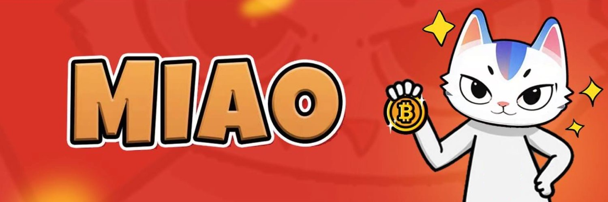

<div align="center">

# **MIAO AI** <!-- omit in toc -->
https://github.com/MIAOAI-Subnet/MIAOAI_SUBNET

### Bridging Pet Tech and Blockchain Innovation <!-- omit in toc -->


[](https://opensource.org/licenses/MIT)

</div>

#  Introduction

MIAOAI is an animals Sound Recognition AI subnet dedicated to creating and interacting with audio content, fostering a playful and entertaining decentralized community.

# Overview
MIAOAI's future ability to generate and manipulate animal vocalizations for interactive and entertainment purposes.

# Key Features

- Animals Sound Recognition
-	Future Meme Audio Creation: Transform user-uploaded audio (e.g., songs, speech) into animal-themed versions using style transfer, perfect for sharing on platforms like X and Instagram.

# Model Performance Comparison

MIAOAI's audio generation and interaction system is built on advanced audio synthesis and processing techniques:
-	WaveNet: A generative model for producing realistic animal vocalizations, trained on a diverse dataset of animal sounds to capture nuances like pitch and tone.
-	Audio Style Transfer with GANs: Uses Generative Adversarial Networks to transform user audio into animal-like sounds, preserving the rhythm while infusing feline characteristics.
-	Emotion-Driven Synthesis: Incorporates a lightweight emotion encoder to adjust generated sounds based on user-selected moods (e.g., happy, curious, sleepy).


# Miner and Validator Functionality

# Overview
- ⚖️ [Validator](./docs/validator.md)
- ⛏️ [Miner](./docs/miner.md)

This tutorial shows how to  run incentives on it using the our testnet.
**important**.
- Do not expose your private key.
- Use only your testnet wallet.
- Do not reuse your mainnet wallet password.
- Make sure your incentives are resistant to abuse.

## Preparation
#### prepare subnet
```bash
git clone https://github.com/MIAO-AI/MIAOAI_Subnet
python3 -m venv btcli_venv
source btcli_venv/bin/activate

# setuo bittensor sdk
pip install bittensor
pip install -e .
```
##  1.running MIAO-recognition
```bash
 git clone https://github.com/MIAO-AI/MIAO-recognition

 cd MIAO-recognition

 python -m venv venv
 source venv/bin/activate
 pip install -r requirements.txt
 python app.py 
```

### start miner
```bash
python neurons/miner.py --netuid 86  --wallet.name miner --wallet.hotkey miner --logging.debug
```

### start validator
```bash
python neurons/validator.py --netuid 86  --wallet.name validator1 --wallet.hotkey validator1 --logging.debug 
```
### check state
```bash
btcli wallet overview --wallet.name miner --netuid 86
btcli wallet overview --wallet.name validator --netuid 86 
```

# Notice
The model always stays on your machine and is yours!
The data provided by our community friends and the benefits and efficiency brought by running in the subnet will better help us train the cat model

