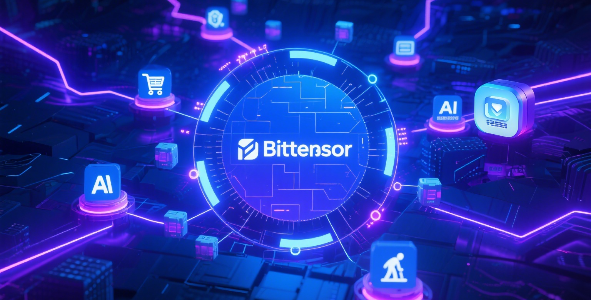

# MiaoAI - A Decentralized AI Training Subnet for E-commerce

MiaoAI is undergoing a major upgrade, fully embracing Bittensor's latest Yuma3 consensus mechanism and strategically transitioning into a foundational training network for AI Agents focused on the e-commerce customer service sector. We are dedicated to leveraging the collective power of a distributed network to provide an efficient, multilingual, scalable, and censorship-resistant AI training platform for the global e-commerce ecosystem.

## Core Upgrades in This Release

This upgrade is deeply optimized around Bittensor's Yuma3 consensus, aiming to build a smarter and more efficient ecosystem for incentives and task allocation.

*   Full Compatibility with Yuma3 Consensus: The subnet has been upgraded to fully support all new features of Yuma3. This lays a solid foundation for us to implement more granular task allocation and dynamic reward mechanisms.

*   Optimized Task Allocation and Incentives: We are enhancing the task allocation and reward models for miners. We encourage validators (clients) to open up their task interfaces to distribute more detailed and valuable training tasks to miners, thereby guiding the entire network to produce higher-quality models. Based on the Yuma3 framework, validators who can effectively distribute high-quality training tasks will also receive preferential rewards.

*   Transition to an E-commerce Customer Service AI Training Network: To enhance the commercial value of the subnet's training, we are positioning it as a foundational training network for e-commerce customer service AI. We provide all validators and miners with a large-scale customer service dialogue dataset from the Alibaba e-commerce platform as a foundational training set to help network participants get started and conduct efficient training.

*   Multilingual Environment Support: The global nature of e-commerce requires AI to have multilingual capabilities. Therefore, this training phase will involve multiple languages. We strongly recommend that network participants properly configure their operating system's multilingual environment when deploying their nodes to ensure the smooth execution of deployment and tasks.

*   Support for New Validators: We welcome new validators to join our ecosystem. If you need technical advice on node configuration, especially regarding port settings, please feel free to contact us through our official channels.

## What is MiaoAI?

MiaoAI is a decentralized AI subnet based on Bittensor, dedicated to training efficient, multilingual customer service AI Agents for the e-commerce domain. We move away from the traditional centralized AI service model by distributing training tasks across a global network of miners to collectively build a powerful foundational AI model for e-commerce. This distributed approach not only ensures high availability and censorship resistance but also continuously drives innovation and efficiency for AI models in e-commerce customer service scenarios through market-based competition and collaboration.

## Key Features

| Feature | Description |
| :--- | :--- |
| E-commerce Specialization | Focuses on e-commerce customer service scenarios, utilizing real-world data for training to make the AI model more practical and commercially valuable. |
| Driven by Yuma3 Consensus | Fully supports the latest Yuma3 consensus to achieve a fairer and smarter dynamic reward and task allocation mechanism. |
| Foundational Training Dataset Provided | Provides a large, high-quality customer service dataset from the Alibaba platform as a starter set, lowering the entry barrier for participants. |
| Multilingual Training Support | The network is designed to support the training of multilingual models to meet the demands of global e-commerce. The system language environment must be configured during deployment. |
| Decentralization & Incentives | Inherits the core advantages of Bittensor, ensuring network stability and censorship resistance through decentralization, and attracting global computing power via an incentive mechanism. |

## Future Outlook: Lucky Cat AI Agent

We are excited to announce that the training outcomes of the MiaoAI subnet will power our upcoming next-generation product: the 'Lucky Cat' AI Agent.

'Lucky Cat' (inspired by the Japanese 'Maneki-neko', symbolizing wealth and good fortune) will be a personalized AI customer service solution designed for e-commerce sellers, which is easy to deploy and configure locally. It can be rapidly configured by loading a local knowledge base (e.g., product information, promotional activities, FAQs), becoming an intelligent customer service expert that truly understands your business.

Stay tuned